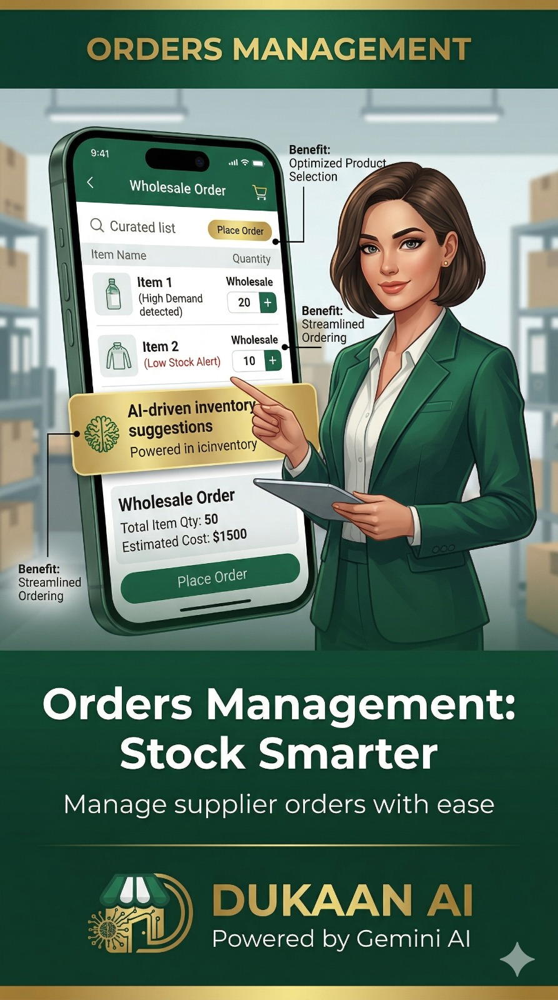

The Indian retail landscape is buzzing with talk of "Quick Commerce"—apps that promise to deliver groceries in 10 minutes or less. For many traditional kirana shop owners, this feels like a direct threat. 

But here is a secret: **The local shopkeeper has advantages that big tech companies can nunca match.** 

To win in 2026, you don't need to build your own multi-billion dollar app. You just need to combine your **existing strengths** with **simple digital speed**.

## Your Secret Weapons

### 1. The Power of Personal Trust
A computer algorithm doesn't know that Mrs. Sharma prefers a specific brand of tea or that the Gupta family needs extra milk on Sundays. **You do.** This personal relationship is your biggest asset. 

### 2. The Relationship-based Credit (Udhaar)
Quick commerce apps require immediate payment. You provide credit to your trusted neighbors. This "Smart Khata" relationship keeps customers loyal during tight months—something big apps can't afford to offer.

### 3. Hyper-Local Knowledge
You know exactly what sells in your neighborhood. You carry the specific regional spices, local brands, and fresh produce that your community loves.

## How to Modernize for Speed

To compete with the "10-minute" promise, you need to remove the friction from your own operations. This is where **Dukaan AI** helps:

### 1. Digitize the "Parchi" (Order List)
Don't let customers wait at the counter while you search for items. Encourage them to WhatsApp you their list. Use Dukaan AI's **Digital List** feature to organize these orders so you can have them packed and ready before the customer even walks in.

### 2. Use Voice to Speed Up Everything
The slowest part of a local shop is manual billing. With **Voice Billing**, you can generate a bill three times faster than typing. Faster billing means shorter queues and happier customers.

### 3. Smart Inventory Planning
Big companies use data to know what to stock. Now you can too. Dukaan AI tracks which items are selling fast so you never run out of the neighborhood favorites.

## Turning the Tide
Quick commerce apps are convenient, but they are impersonal. By using AI to handle the "boring" parts of shop management (billing, bookkeeping, orders), you free up your time to do what you do best: **Talking to your customers and building the community.**

The future of Indian retail isn't just big apps or small shops—it's **Modern Kiranas** that are fast, digital, and deeply local.

**Make your shop a Modern Kirana with Dukaan AI.**
