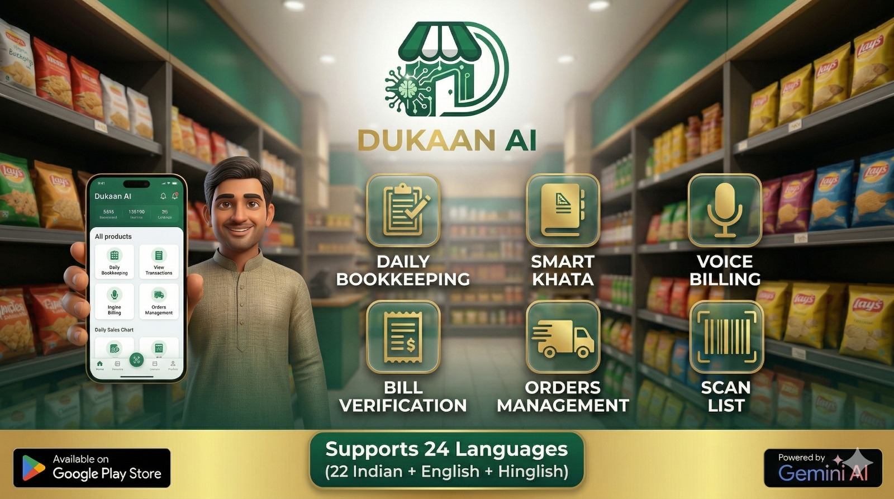

भारत के हर मोहल्ले के दिल में एक **दुकान** होती है। यह सिर्फ किराने का सामान खरीदने की जगह नहीं है; यह भरोसे का केंद्र है, उधार देने वाला है और स्थानीय समुदायों की रीढ़ है। हालांकि, भारत में रिटेल का माहौल पहले से कहीं ज्यादा तेजी से बदल रहा है।

क्विक कॉमर्स ऐप्स और बड़े सुपरमार्केट के आने के साथ, आज के दुकानदारों के पास एक महत्वपूर्ण विकल्प है: **आधुनिक बनें या पीछे छूट जाएं।** यह गाइड बताती है कि कैसे आप साधारण डिजिटल टूल्स और AI का उपयोग करके अपनी पारंपरिक किराना दुकान को एक हाई-परफॉर्मेंस वाले आधुनिक बिजनेस में बदल सकते हैं।

## 1. हर दुकान को डिजिटल 'दिमाग' की जरूरत क्यों है
दशकों से, दुकान चलाने का मतलब था सब कुछ अपने दिमाग में या पुरानी डायरी (बही खाता) में याद रखना। हालांकि इसने अतीत में काम किया, लेकिन आज यह "अदृश्य नुकसान" पैदा करता है:

- **भूला हुआ उधार:** छोटे-छोटे उधार जिन्हें कभी रिकॉर्ड नहीं किया गया और कभी वापस नहीं मिला।
- **गलत मुनाफा:** खर्चों के बाद ठीक से पता नहीं होना कि आपने कितना कमाया।
- **खत्म हुआ स्टॉक:** ग्राहकों को खोना क्योंकि आपको पता ही नहीं चला कि कोई सामान खत्म हो गया है।

> "AI दुकानदार की जगह लेने के लिए नहीं है; यह दुकानदार को सुपरपावर देने के लिए है।"

## 2. "स्मार्ट खाता" मैनेजमेंट में महारत हासिल करना
बड़े स्टोर की तुलना में एक स्थानीय दुकान का सबसे बड़ा फायदा **उधार (Udhaar)** है। आपके ग्राहक आप पर भरोसा करते हैं और आप उन पर। लेकिन कागज के रजिस्टर उलझे हुए होते हैं।

**स्मार्ट खाता** सिस्टम पर जाकर, आप यह कर सकते हैं:
- कुछ ही सेकंड में एंट्री रिकॉर्ड करें।
- भुगतान के लिए ऑटोमैटिक व्हाट्सएप रिमाइंडर भेजें।
- एक साफ इतिहास रखें जो आपके ग्राहकों के साथ और भी ज्यादा भरोसा बनाता है।

## 3. वॉइस बिलिंग की ताकत
किसी भी भीड़-भाड़ वाली दुकान में सबसे बड़ी समस्या बिलिंग काउंटर है। बारकोड टाइप करना या कीमतों को मैन्युअल रूप से खोजना बहुत अधिक समय लेता है। यहीं पर **वॉइस बिलिंग** खेल बदल देता है।

कल्पना करें कि आप अपने फोन से कह रहे हैं: *"2 पैकेट चीनी, 1 लक्स साबुन और 1 लीटर दूध"* और बिल तुरंत तैयार हो जाए। यह "वॉइस-फर्स्ट" तरीका आपको कीबोर्ड के बजाय अपने ग्राहकों के चेहरों पर ध्यान केंद्रित करने की अनुमति देता है।

## 4. स्मार्ट ऑर्डरिंग और इन्वेंट्री
क्या खरीदना है और कब खरीदना है, यह जानना ही बड़े मुनाफे का राज है। पारंपरिक दुकानें अक्सर धीमी गति से बिकने वाले सामानों का ज्यादा स्टॉक रखती हैं और लोकप्रिय सामानों को खत्म कर देती हैं। Dukaan AI जैसे टूल्स आपके बिक्री के पैटर्न का विश्लेषण करते हैं और आपको ठीक-ठीक बताते हैं कि आपको अपने व्होलसेलर से क्या ऑर्डर करने की जरूरत है।

## 5. क्विक कॉमर्स का मुकाबला कैसे करें
बड़े ऐप्स 10 मिनट में डिलीवरी का वादा करते हैं, लेकिन उनमें एक स्थानीय दुकानदार के व्यक्तिगत स्पर्श की कमी होती है। जीतने के लिए, आपको अपने **स्थानीय संबंधों** को **डिजिटल स्पीड** के साथ जोड़ना होगा:

- **डिजिटल लिस्ट:** ग्राहकों को व्हाट्सएप पर अपनी लिस्ट भेजने के लिए कहें।
- **फास्ट बिलिंग:** व्होलसेलर से अपने खरीद बिलों को सत्यापित करने के लिए AI स्कैनर टूल्स का उपयोग करें।
- **होम डिलीवरी:** बड़े ऐप्स जितनी ही स्पीड देने के लिए अपने स्थानीय स्टाफ का उपयोग करें।

## निष्कर्ष
अपनी दुकान को आधुनिक बनाने के लिए कंप्यूटर या महंगी IT टीम की जरूरत नहीं है। आपको बस एक एंड्रॉइड फोन और सही पार्टनर की जरूरत है। **Dukaan AI** विशेष रूप से उन भारतीय रिटेलर्स की जरूरतों के लिए बनाया गया है जो अपनी दुकान से डिजिटल क्रांति का नेतृत्व करना चाहते हैं।

पहला कदम उठाने के लिए तैयार हैं? आज ही अपना खाता डिजिटल करना शुरू करें और अपने बिजनेस को बढ़ते हुए देखें।
